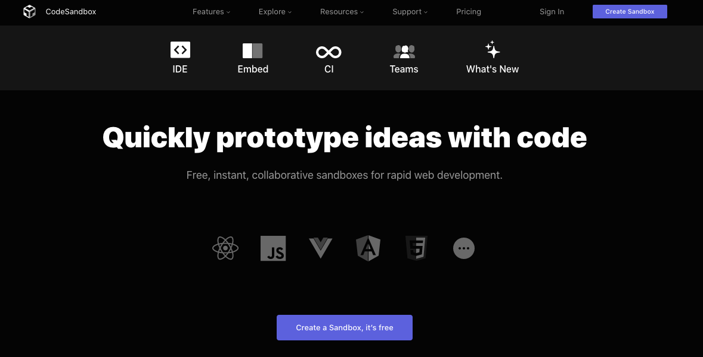
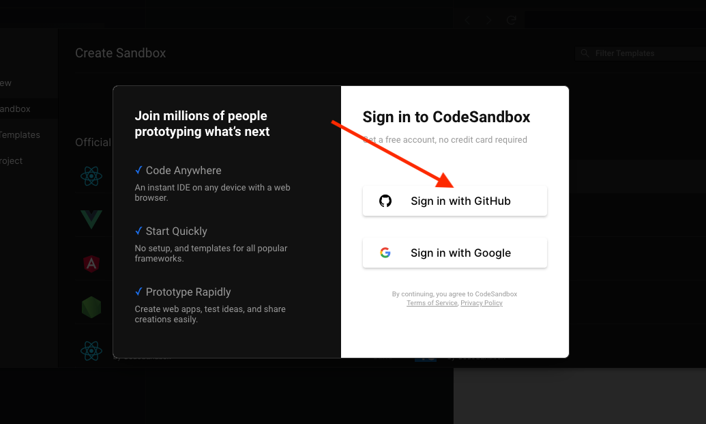
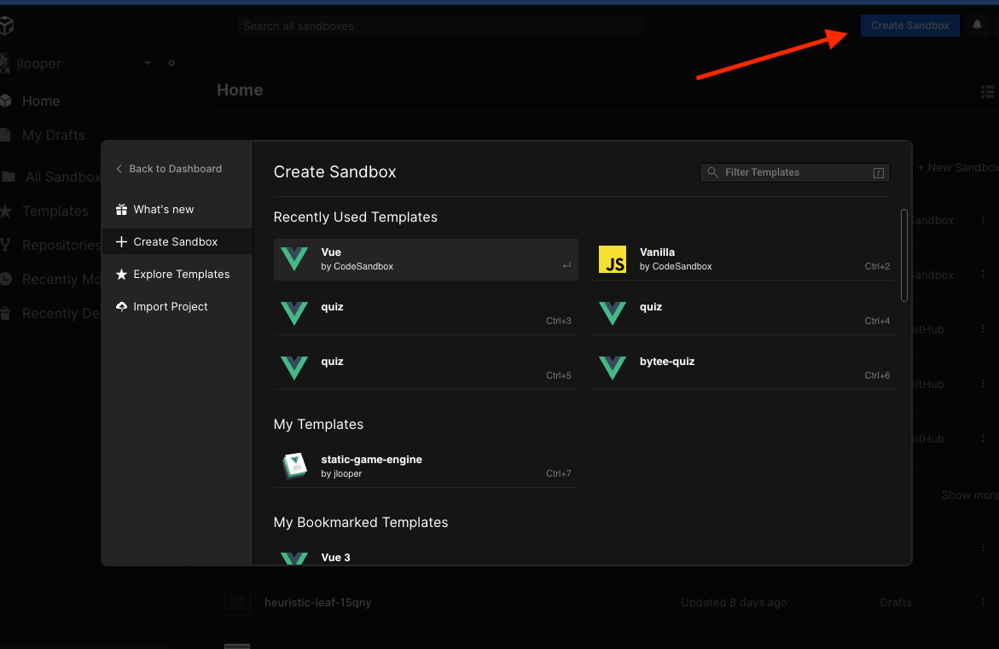
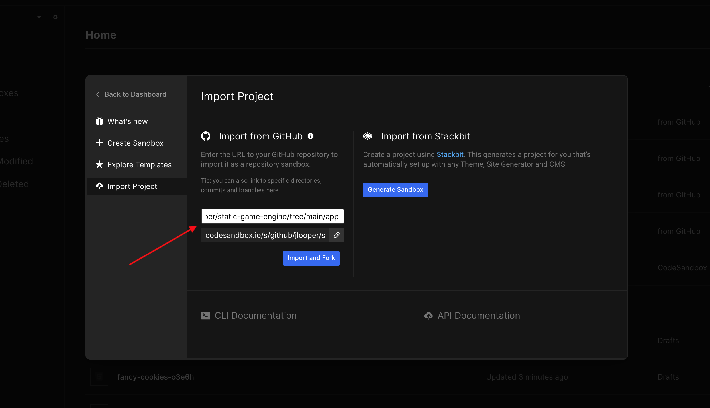
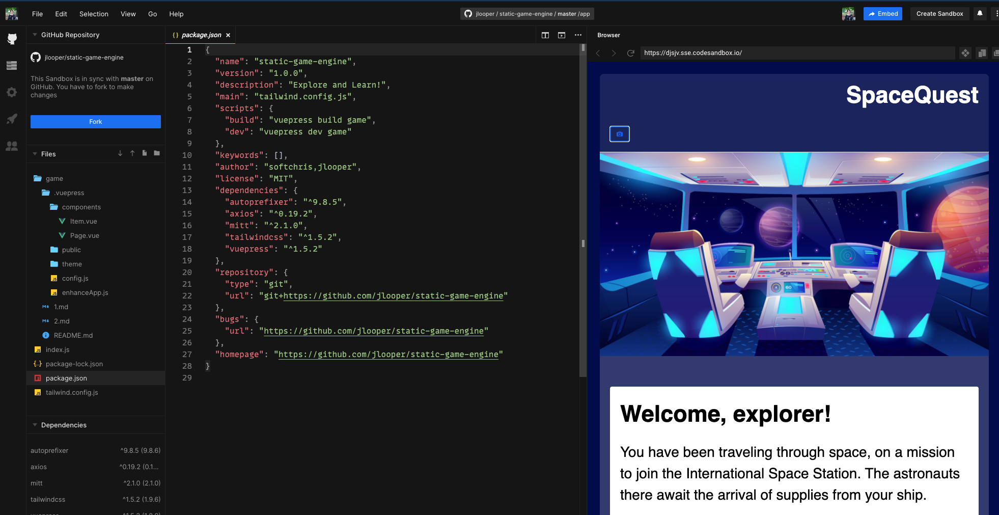

## Setting up Code Sandbox

Here are the steps you can follow to get started with the static game engine in Code Sandbox. You can use imported code from GitHub to avoid a local installation.

1. Navigate to [GitHub](https://www.github.com) and create an account or sign in to your account.

2. Navigate to [Code Sandbox](https://codesandbox.io). The home page looks like this:

3. Sign in at the top of Code Sandbox, using your GitHub login.

4. Click the 'create a Sandbox' button; a popup opens.

5. Click 'import sandbox' in this popup. Create a new Sandbox by pasting this URL in the box below:

> `https://github.com/jlooper/static-game-engine/tree/main/app`

6. Click 'import and fork'. Your new sandbox imports the code, builds the project, and your scaffolded project looks like this:

