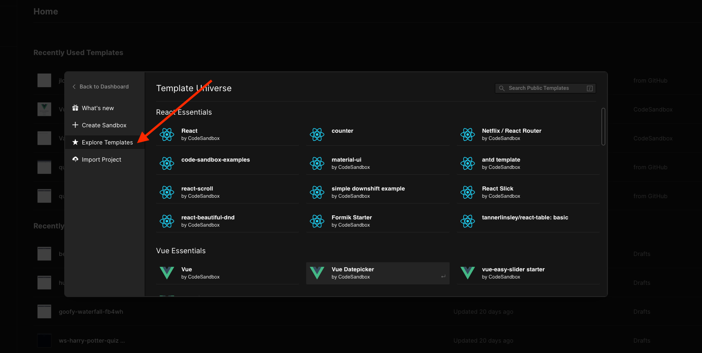
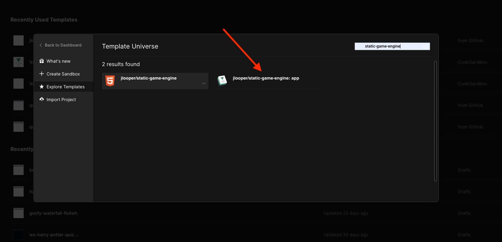

## Setting up Code Sandbox with a template

Here are the steps you can follow to get started with the static game engine in Code Sandbox. You can use a template to avoid local installation.

1. Navigate to [Code Sandbox](https://codesandbox.io). The home page looks like this

2. Sign in at the top, using your GitHub login. If you don't have a GitHub login, create one on [GitHub.com](https://github.com) and use those credentials to login to Code Sandbox.

Click the 'create a Sandbox' button; a popup opens.

Create your sandbox by searching 'template universe' for 'static-game-engine'. 

There are two templates available; use the one with the VuePress logo. Choose this template and your site is scaffolded (setup in Code Sandbox's environment).

Your scaffolded project looks like this:

