# Workshop Instructions

| **Tutorials**              | Overview of tutorials                             |
| ----------------------------- | --------------------------------------------------------------------------------------------------|
| **First tutorial on MakeCode** | [Intro to MakeCode tutorial](./workshop-makecode.md)      |
| **Second tutorial on MakeCode, gravity** | **You're here**  |

## Second tutorial on MakeCode, gravity

In this workshop, we will learn how to build a game using MakeCode arcade. You will build game that uses the idea of gravity.

| **Project Goal**              | build a game, that you can share with friends                             |
| ----------------------------- | ------------------------------------------------------------------------------------------------- |
| **What will you learn**       | You will create a game by dragging and dropping blocks       |
| **What you'll need**          | Follow the instructions in the **getting started** section below                                  |
| **Duration**                  | You will build the game as you follow the instructions     |

## Getting started

1. Open up a browser and navigate to **[https://arcade.makecode.com/](https://arcade.makecode.com/)**.

1. Select **New Project** (it's a big orange button)

1. In the textbox type a name for your game, you decide what to name it, but you can type **Gravity game** for example.

   Here what the dialog box looks like 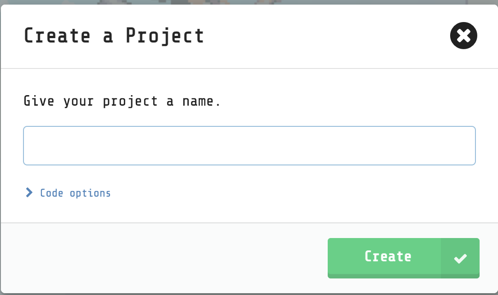

1. Select **create**.

   Once you've selected the green button, you will see the editor, where you will build your game. 

## Creating the game

So what are you building? You're building a game where you control a character. The world has gravity and is empty save for a few logs the character can stand on. You need to ensure your character move from log to log so they don't fall to the ground at which point the game would end.

Here's a picture of what the finished result looks like:

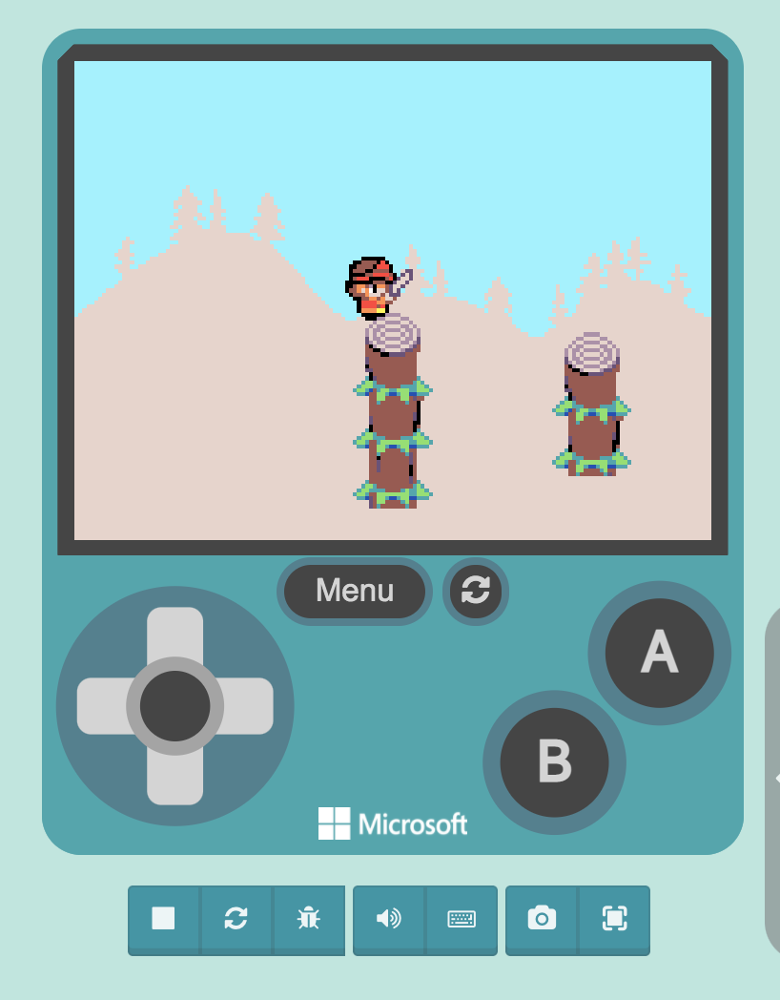

## Create a world

1. Select scene
1. Select a block that looks like so

   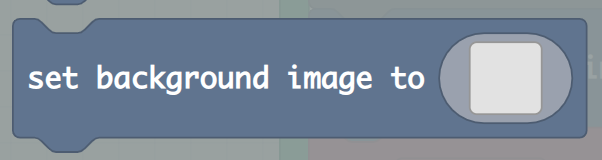

1. Select the grey sprite area, and select a background like so:

   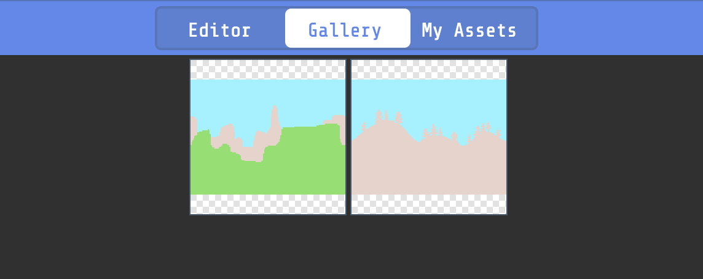

1. Select the green **Done** button in the bottom right.

## Create log

1. Select the same block as you did creating the player.

   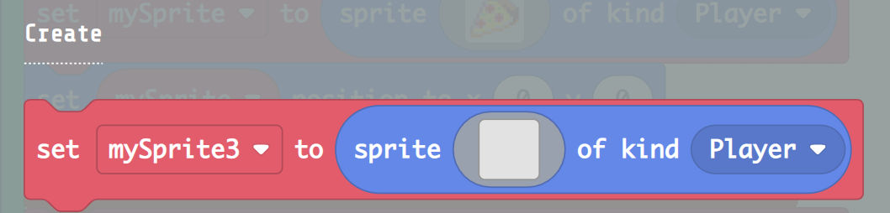

   Don't worry, it should be the same block, you're going to adjust it slightly.

1. Select the left drop down menu and select the option **Rename variable**, give it the value **trunk**.

1. Select the drop down menu to the right in the block and ensure you select **Add a new kind...** instead of player. Give it the name **Obstacle** when asked.

1. Place the block so that it connects with the **on start block**.

## Change log image

Next you will change the appearance of the log sprite.

1. Select the grey sprite area:

   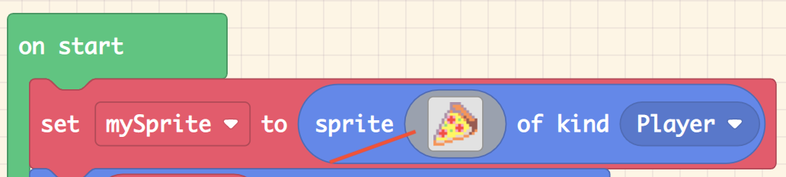

    Like before, this will bring up a window where you can select a sprite. This time however, you will select a tree log.

1. Select the log in the bottom middle part of the gallery like so:

   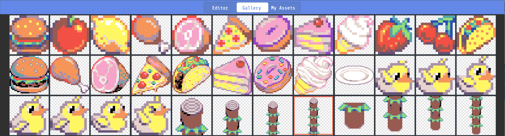

## Position log obstacle

1. Select the **sprites** menu option.

1. This time, select a block that looks like so:

   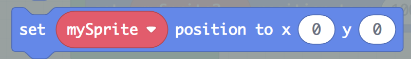

   1. Select the input text area for the **X**. It should bring up a menu that looks like so:

      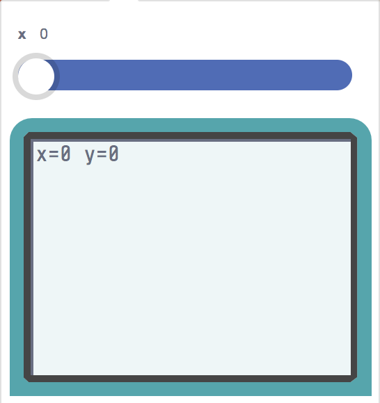

      Ensure the slider is all the way to the left and has the value **50**.

   1. Click anywhere in your editor (that's not the edit window) to close it.

   Now, repeat the steps for **Y**.

   1. Select the input text area for the **Y**.

      Ensure the slider is all the way to the left and has the value **120**.

   1. Click anywhere in your editor (that's not the edit window) to close it.

Now create a new obstacle like the one you created above.

> Remember the steps, create the object, change the sprite image, position it.

Ensure you name it **trunk2** and that the position is **100** and **120** for y. Look at your viewer on the left. It should now look like so:

   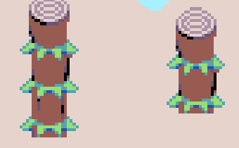

## Create a player

The player is a character that you will end up controlling. A player can look like many things. It can look like a chess piece, super mario, a space ship, or even a like a pizza slice.

1. Select the **sprites menu**
1. Select a block that looks like the following:

   

1. Drag the selected block into the right area and within the green block so it connects, like so:

   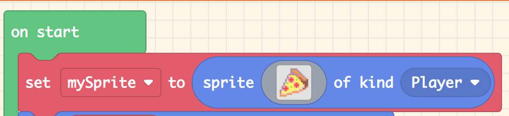

1. Select the left drop down menu and select the option **Rename variable**, give it the value **hero**.

1. With your mouse, select the sprite area, like so:

   

   This will bring up the following window:

   1. Select the **Gallery** option on top.
   1. Next, select the image that looks like a a hero with a sword in the bottom left.

   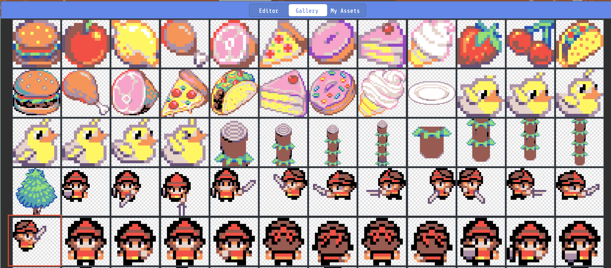

   1. Select the green **Done** button in the bottom right.

## Position player

1. Select the **sprites** menu option.

1. This time, select a block that looks like so:

   

   1. Select the input text area for the **X**. It should bring up a menu that looks like so:

      

      Ensure the slider is all the way to the left and has the value **100**.

   1. Click anywhere in your editor (that's not the edit window) to close it.

   Now, repeat the steps for **Y**.

   1. Select the input text area for the **Y**.

      Ensure the slider is all the way to the left and has the value **120**.

   1. Click anywhere in your editor (that's not the edit window) to close it.

## Control hero

Next, you will learn to controlling the hero, to move it across the screen.

1. Select the menu option **Controller**.

1. Select the block that looks like so:

   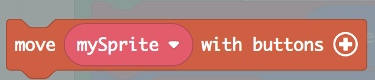

1. Drag this block and place it so it connects with the green block.

1. Ensure the **vx** and **vy** values both are set to **100**, like so:

   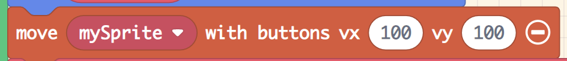

   What this instruction does is to tell the game how much the player should move in pixels.

## Add gravity

Gravity is about acceleration, how much the speed changes in a game. There's two ways to approach it:

- **Simulate gravity with speed**. You can set a vertical speed, it's good enough for most games, there's a `vx` property you can set. A positive value moves your object down on the screen.
- **Set gravity**. There is a `va` field that represents gravity. That's acting like real gravity.

For gravity to be meaningful addition in a game, you need a _falling_ object to collide with something and halt. Therefore you need a way to detect collisions with certain objects considered as _solid objects_. You also need some logic that ensure a falling object starts falling again once they are not on a _solid object_.

1. Select the **Sprites** menu and select a block that looks like so:

   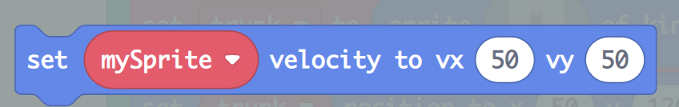

   Ensure **hero** is selected in the first dropdown to the left.

   Select input for **VY** and enter **20**. Now the hero will fall with certain velocity. Next you need to implement logic that ensures the hero doesn't fall forever.

## Add game logic

There are rules you are about to implement:

- **Logs are solid objects**. If colliding with logs, set `vy` to **0**.
- **Ensure hero is always falling, if not on a log**. If hero is not colliding and vy is 0, then set `vy` to **20**.
- **If hero has hit the ground**. Display a message that you lost the game. Add a delay and then destroy hero.

### Log collision

1. Select **Sprites** and select a block that looks like so, and place it in the free space (not in the green block):

   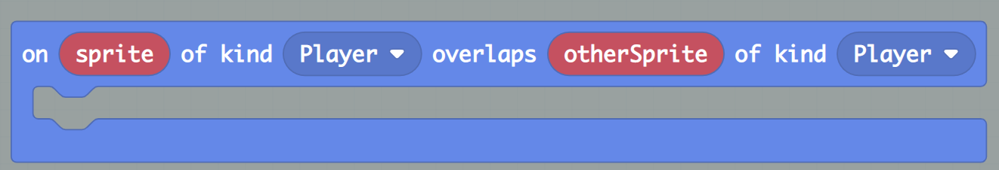

   Ensure the first dropdown says **Player** and the right most dropdown says **Obstacle**.

1. Select **Sprites** and select a block that looks like so, and place it within the collision block:

   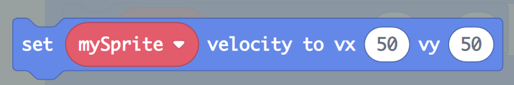

   Ensure the dropdown says **hero** and that `vx` and `vy` says **0**, as you are essentially saying _if hero collides with a log then hero should stop falling_.

### Readd vertical speed

You need logic that says, if the hero is no longer on the log and their speed is 0, then readd the gravity, otherwise your hero will float in midair.

1. Select **Game** and the block that looks like so, and place it in anywhere in the free space:

   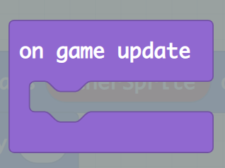

1. Select **Logic** and block that looks like so, and place it in the _on game update_ block.

   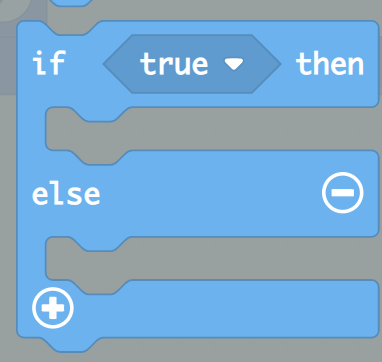

   This block will allow you to express so called _flow logic_, what should happen given a certain condition.

1. Select **Logic** and select a _comparison block_ and drop it in the IF area of the IF-ELSE block:

   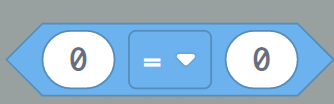

   After having dropped the block, it should look like so:

   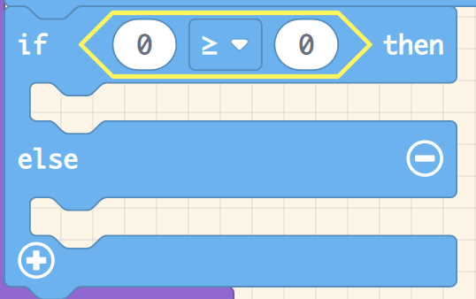

   Ensure drop down is showing **>=**, ie. larger than.

1. Select **Sprites** and select this block.

   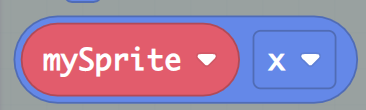

   Now place that block inside the left input, inside of the comparison block like so:

   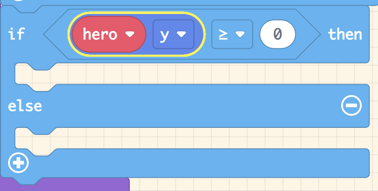

   Set the remaining input field to 120, that's the max height of the screen, i.e we are saying _if your hero has hit the ground, do something_.

1. Select **Sprites** and select this block and place it within the body of the IF statement:

   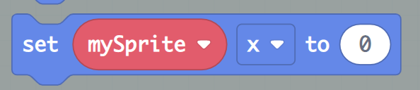

   Ensure the first dropdown says **hero** and the second one says **vy (velocity y)** and the right most input should say **0**. You're now stating _hero should stop falling when it hits the ground_.

1. Select **Sprites** and a block looking like so and place it right after the previous block:

   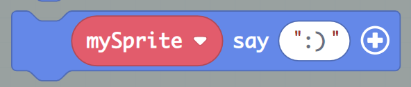 

   Change the first dropdown to **hero** and type **ouch** in the input field. Your hero will now say "ouch" when it hits the ground. Select the **+** and in the _for_ field input **1000**. That means the "ouch" is visible for a second. Next, you will destroy the hero after 1 second. You will have to do that in code 

1. Select **JavaScript** at the top and locate code that looks like so:

   ```javascript
   game.onUpdate(function () {
    if (hero.y >= 120) {
        hero.vy = 0
        hero.say("Ouch", 1000)
    } else {
    }
   })
   ```

   Add timeout code by changing the above code block to:

   ```javascript
   game.onUpdate(function () {
    if (hero.y >= 120) {
        hero.vy = 0
        hero.say("Ouch", 1000)
        setTimeout(() => {
          hero.destroy()
        }, 1000)
    } else {
    }
   }) 
   ```

   What you added was this code:

   ```javascript
   setTimeout(() => {
     hero.destroy()
   }, 1000)
   ```

   which says to destroy your hero after 1 second (1000 milliseconds).

1. Select a block looking like so and drop it in the ELSE part:

   

   Ensure the dropdown says **hero** and that `vx` says **0** and `vy` says **20**, as you are essentially saying _set velocity back to 20.

1. else block, set velocity back to 20

## Add follow camera

A follow camera means that one of your sprites will be followed at all times. This is something you typically see in movies when you follow in the foot steps of an action hero for example.

1. Select **Scene** and block looking like so and drop it in the green **on start** block:

   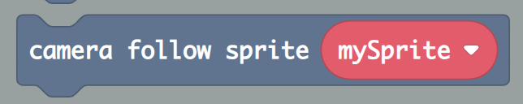

   Ensure the first drop down says **hero**. That's it, that is your entire game.

A demo of a running game looks like this:

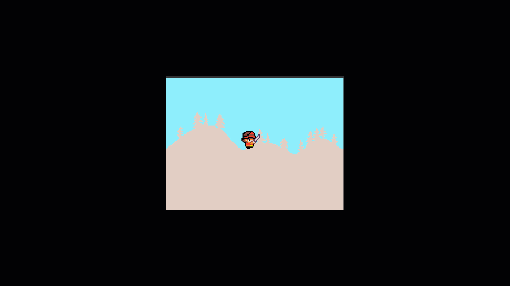  

Here's the full code in blocks:

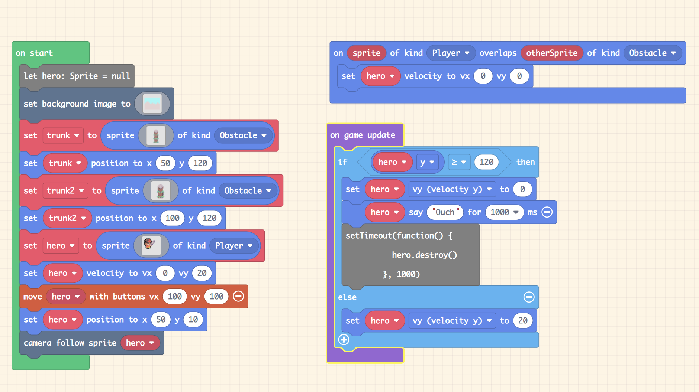   