# Workshop Instructions

In this workshop, we will learn how to build a game using MakeCode arcade. MakeCode arcade is a platform where you can use code or blocks to build games

| **Project Goal**        | build a game that you can share with friends                     |
| ----------------------- | ---------------------------------------------------------------- |
| **What will you learn** | You will create a game by dragging and dropping blocks           |
| **What you'll need**    | Follow the instructions in the **getting started** section below |
| **Duration**            | You will build the game as you follow the instructions           |

## Getting started

1. Open up a browser and navigate to **https://arcade.makecode.com/**.

1. Select **New Project** (it's a big orange button).

1. In the textbox type a name for your game, you decide what to name it, but you can type **fruit game** for example.

   Here what the dialog box looks like 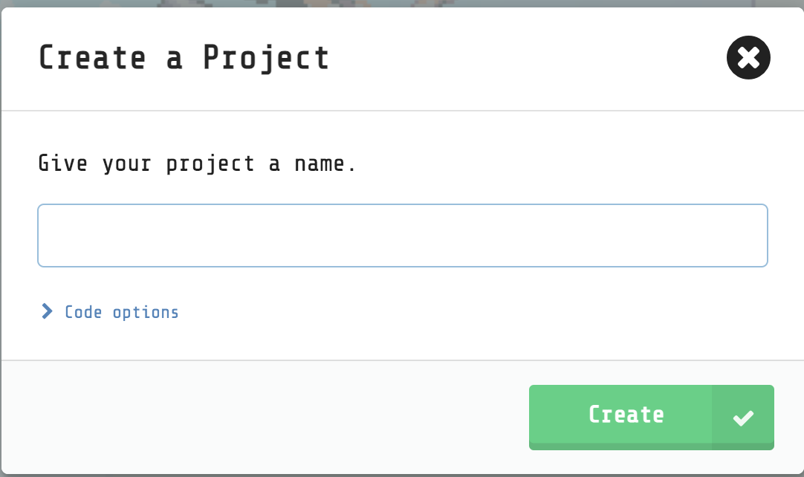

1. Select **create**.

   Once you've selected the green button, you will see the editor, where you will build your game. 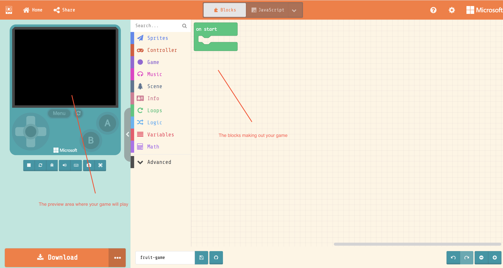

## Creating the game

You start the game with big green block that says **on start**, on your right. **on start** is a moment in your game representing when the game start

> Think for a minute on two on games that you've played and what happens during start. You might have seen an intro video or text and some music playing perhaps. Or lets take a board game like chess, what happens at the moment of creation is all pieces being placed on the board. All black pieces on one side and all white pieces on one side.

So what are we building? We're going to build a game where a pizza slice chases a taco across the screen. When the slice manages to capture the taco, the game is over.

### Create a player

The player is a character that you will end up controlling. A player can look like many things. It can look like a chess piece, super mario, a space ship, or even a like a pizza slice.

1. Select the **sprites menu**
1. Select a block that looks like the following:

   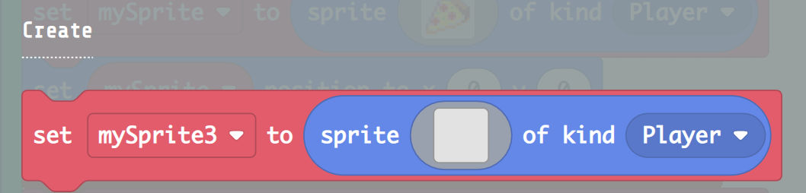

1. Drag the selected block into the right area and within the green block so it connects, like so:

   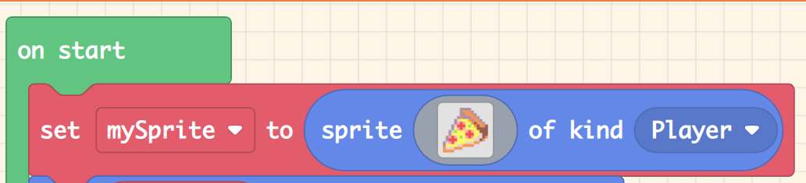

1. With your mouse, select the sprite area, like so:

   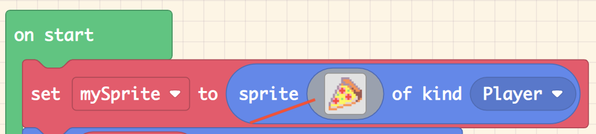

   This will bring up the following window:

   1. Select the **Gallery** option on top.
   1. Next, select the image that looks like a pizza slice.

   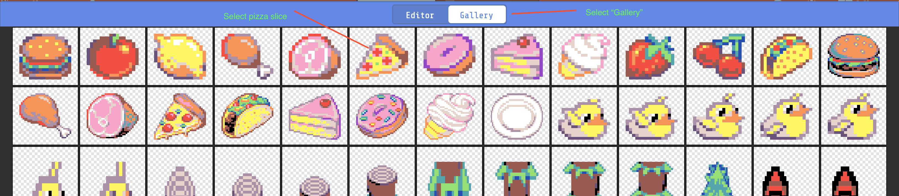

   1. Select the green **Done** button in the bottom right.

### Position player

You want to place the player in nice starting position. For this game, you will place the player in top left corner.

1. Select the **sprites** menu option.

1. This time, select a block that looks like so:

   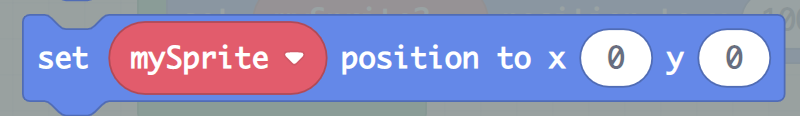 

   1. Select the input text area for the **X**. It should bring up a menu that looks like so:

      

      Ensure the slider is all the way to the left and has the value 0.

   1. Click anywhere in your editor (that's not the edit window) to close it.

   Now, repeat the steps for **Y**.

   1. Select the input text area for the **Y**. 

      Ensure the slider is all the way to the left and has the value 0.

   1. Click anywhere in your editor (that's not the edit window) to close it.
  
Look at the left, you can now see that your player has moved to the top left.

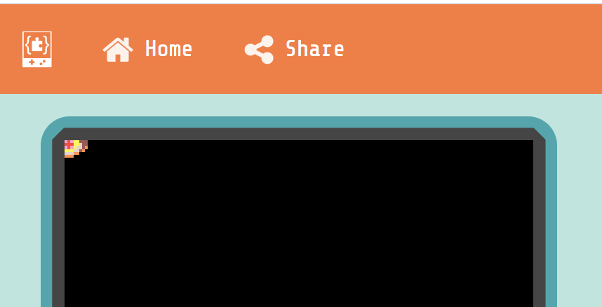

### Create an enemy

Next, you will create an enemy, something that you need to defeat to win the game.

1. Select the same block as you did creating the player.

   

   Don't worry, it should be the same block, we're just going to adjust it slightly.

1. Select the drop down menu to the right in the block and ensure you select **Enemy** instead of player. 

1. Place the block so that it connect with the **on start block**.

### Change enemy sprite

Next you will change the appearance of the enemy sprite.

1. Select the grey sprite area:

   

   Just like before, this will bring up a window where you can select a sprite. This time however, you will select a taco over a pizza slice.

1. Select **gallery** in the sprite window.

   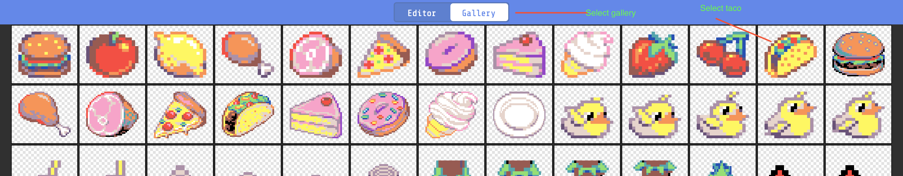

   Select the taco.

1. Select the green **Done** button in the bottom right.

### Control the hero

Next, you will learn to controlling the hero, to move it across the screen. 

1. Select the menu option **Controller**.

1. Select the block that looks like so:

   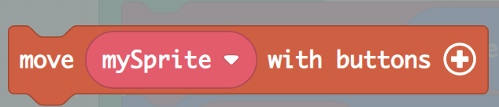

1. Drag this block and place it so it connects with the green block.

1. Ensure the **vx** and **vy** values both are set to **100**, like so:

   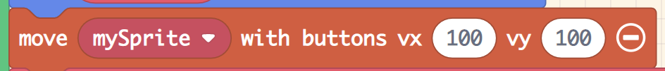 

   What this instruction does is to tell the game how much the player should move in pixels.

### Testing out your game

It's good practice to test your game now and then, to ensure all changes works as predicted. Because you've just added the capability to to move your hero, your game just got a little bit exciting. 

Next, you will test out your game from the preview area on your left. 

1. Select the play button like so:

   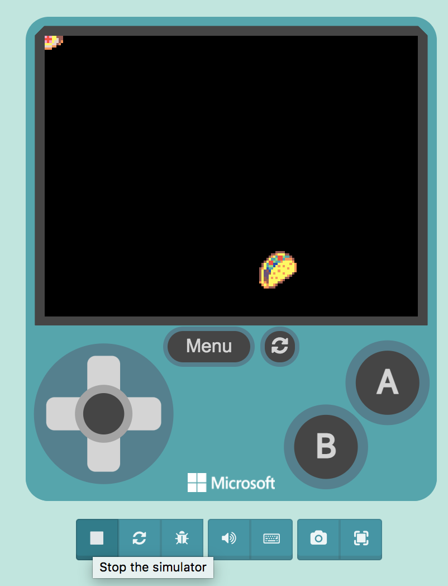

   When you press play, the icon changes to a stop symbol. You can always press the stop symbol and then press play to restart the game, whenever you need to.

   You can use the joystick on the game pad and select the direction you want, up, down, left, right, like so:

   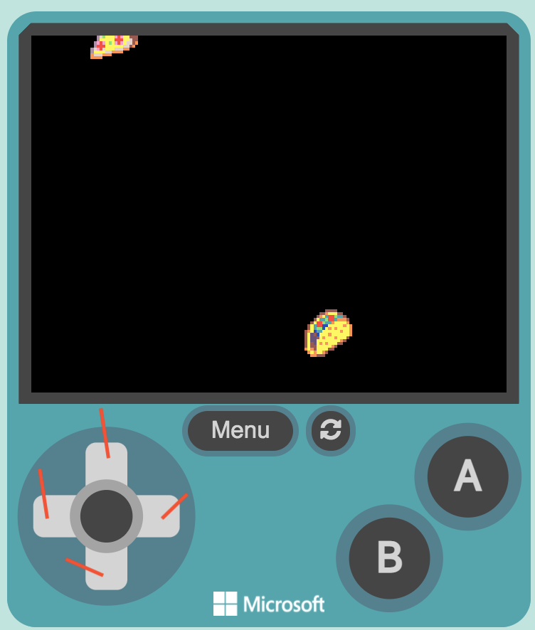

   You should see the pizza slice (your player) moving on the screen.

### Adding game rules

As part of making a game into a game, there should be something for the player to do like

- **Defeat enemies**
- **Collect points**
- **Move from one game level to the next**

In this game, you will chase the enemy, the taco. You decide on the following:

- If I capture the enemy, the taco, I should be awarded a point, and the taco should be eaten/destroyed.

Lets implement this game rule.

**On player-enemy collision - do something**

1. Select **sprites** from the menu.
1. Select a block that looks like so:

   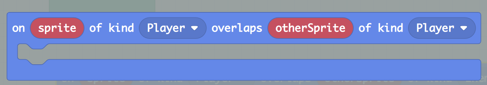

   You might need to scroll a bit down to find it. This block expresses logic that says, if hero collides with something, then something should happen.

   Drag this block to the editor. Place it outside of the green block.

1. Ensure this block says the following **on sprite of kind player overlaps otherSprite of kind Enemy**
1. Select **sprites** and select a block that looks like so:

   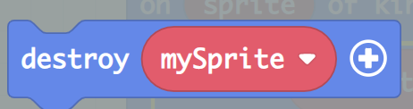

   Drag this block and place it within the block that says **on sprite of kind player overlaps otherSprite of kind Enemy**. What this will do is to destroy the enemy if player and enemy collides.

1. Select **info** from the menu and select a block that looks like so:

   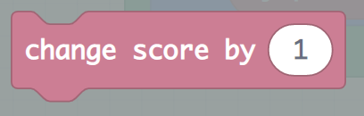  

   Drag this block and place it within **on sprite of kind player overlaps otherSprite of kind Enemy**.

Your entire game should now look like so:

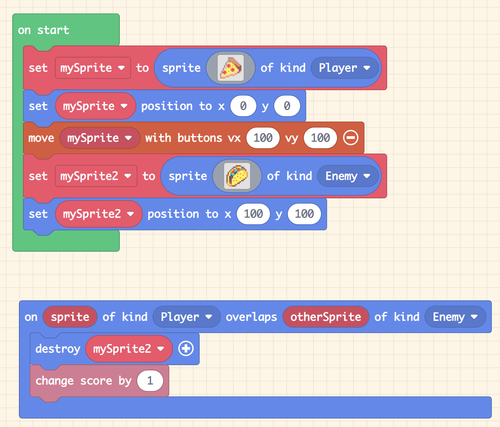

and if you play test it, it should run like so.

1. Navigate your hero to collide with the taco
1. See the slice get destroyed
1. See your game score be incremented by 1, from 0 to 1.

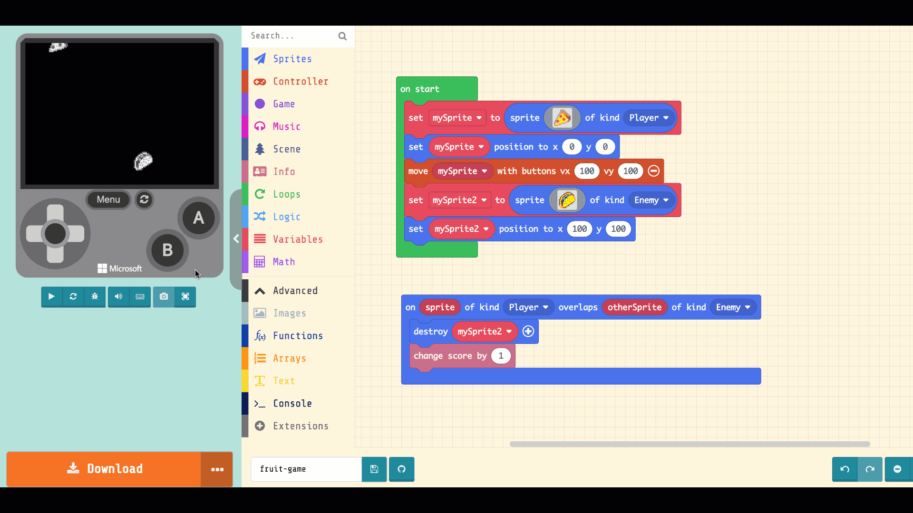