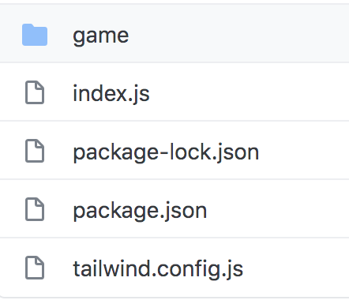
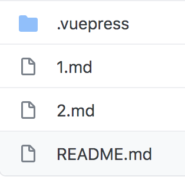
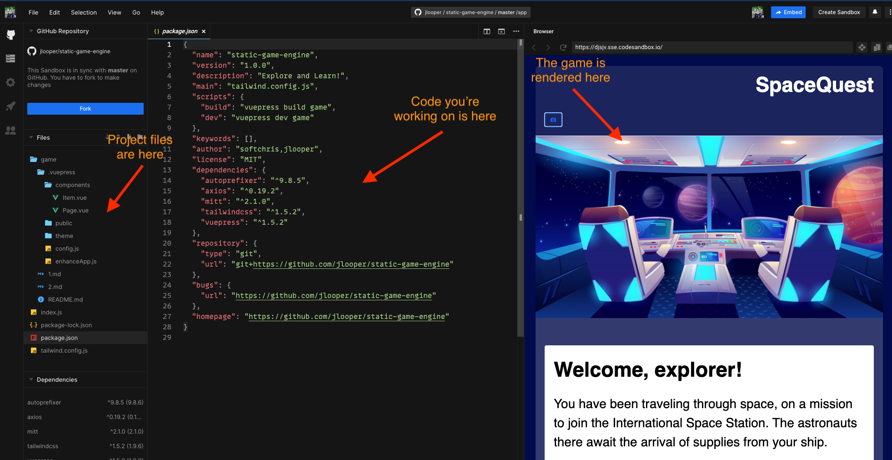

# Workshop Instructions

In this workshop, we will learn how to build a 'Choose Your Own Adventure' game using VuePress, a library that helps you create a text-based web site. VuePress is often used for documentation, but we are going to create a text-based game instead.

| **Project Goal**              | *build a 'choose-your-own-adventure type text-based game for the web*                             |
| ----------------------------- | ------------------------------------------------------------------------------------------------- |
| **What will you learn**       | You will create a storytelling choose-your-own adventure type game by enhancing sample code       |
| **What you'll need**          | Follow the instructions in the **getting started** section below                                  |
| **Duration**                  | 1 hour instruction and as many hours as you like afterwards to create an intriguing storyline     |
| **Just want to try the app?** | A game using this engine at its core is the [Azure Maya Mystery](https://aka.ms/AzureMayaMystery) |

## Getting Started

There are a couple of ways you can work on your game:

- **locally** on your own computer.

   👉 [Click here for instructions on how to get setup locally](https://github.com/jlooper/static-site-engine)

- **in a hosted online environment**.

   👉 [Click here for instructions on how to get setup in Code Sandbox](./sandbox.md)

📌 Task: Choose one of the two above links.

Once your project is setup either locally or in a hosted environment, you can continue.

> For our Teams workshop, we will work in Code Sandbox, so choose the [second link](./sandbox.md).

## Preparation

So, you want to make a game! Think about what kind of game you'd like to build. Here are some ideas:

- **Spooky castle**. Maybe you want to explore a spooky castle?
- **Mysterious temple**. How about a mysterious temple in Peru?
- **Roman ruin**. Or a Roman ruin in Italy?
- **Greek temple**. A Greek temple where, each night, the local people report seeing lights and hearing music?
- **Your own idea**. You decide what you want to create.

📌 Task: Select one of the ideas above.

> 💡 Think about the images that might accompany your game, and a storyline you want to tell. In this game, you wander through a location, picking up items. What kind of items do you want your player to collect?

Since this is a 'choose-your-own-adventure' type game, you can also have several paths to offer your player. What paths can you send your player down, and are some of those dead ends?

> ☕️ Take a minute to tell or write down your idea

## Your Project Files

Here's an overview of the files in your project:



You will work in the directory `game`. If you look inside the `game` folder, you will see the following:



You have something called _seed code_, a set of files that are already there, that you can modify if you want.

There are files ending in `.md` that represents a room or moment in the game. Right now there are three of them, `README.md`, `1.md` and `2.md`. They are different, so let's look at what they do:

- **Home page, README.md**. This page has a link on it. By clicking the link you will be taken to a new situation happening in the game.
- **First page, 1.md**. The first page has two links representing two items. If you click an item, it will be added to your inventory. The inventory is on your left side.
- **Second page, 2.md**. This is another situation in the game, accessible when you click a link on `1.md`. 

## Explore the Game Play

Code Sandbox installs and runs your code automatically. You should see a panel with your game running on the right and a panel with your code on the left. A left-hand navigation panel on the far left side of the screen shows all the files available in your project.

Every time you make a change to your code on the left and save your file, it is updated in the right panel.

> ❗️If you see a circle next to the file name in your editor, that means you haven't yet saved your file. As you work, make sure to keep saving your work so you see it quickly and don't lose it.

What you see is a rendered version of the file `README.md`, the game's home page:



> 💡 Spend a few minutes going through the codebase and see how it functions.

📌 Optional Task: You can see your game outside of Code Sandbox, as well! In the game panel, click the link at the top right (when you hover over it, it says 'open in new window'). You will see the game in a full browser, with the inventory panel viewable on the left.

### Your app's packages: `package.json`

In the `game` folder, you find a list of the packages that make up the web app listed in the `package.json` file. 

You can see that this is a VuePress site because that package is listed in the dependencies. You also use 'TailwindCSS', a nice way to style your app by adding classes to your html.

### Styles: make your game look good

Note the `tailwind.config.js` file in the root of the app. The styles of this app are driven by the [Tailwind CSS library](https://tailwindcss.com).

You can see how Tailwind markup styles
elements by looking at `app/game/.vuepress/components/theme/layouts/Layout.vue`.

Syntax like this:

```html
<div class="markdown-body font-serif bg-white m-2 sm:m-3 md:m-6 lg:m-12 text-lg rounded-lg">
``` 

is typical of Tailwind. Adding the class `bg-white` for example creates a white background for a given `<div>` tag.

**Overriding styles**

You can override Tailwind styles or add new ones in the `game/.vuepress/components/theme/styles/` folder. In the `index.styl` file you can tweak a few styles to create a different look for your game.

> It's amazing how a new font can change the entire feel of your game.

📌 Optional Task: Install and use a new font
 
1. **Create a folder** in the `/game/.vuepress/public` directory called **fonts** by hovering over the `public` folder in the files panel and clicking the folder icon. 

2. **Download a font**. You can download free ones in .ttf format (TrueType Fonts) at [fontsquirrel](https://www.fontsquirrel.com).

3. **Use font**. To make fonts show, edit the font .src:

   ```css
   src: local('your-font-name'), url(/fonts/your-font-file-name.ttf) format('ttf');
   ```

📌 Optional Task: Change colors of your game

1. Look in `game/.vuepress/theme/styles/index.styl` for the `body` tag. It has a background color, formatted like this: `background-color: #000C4C;`. Let's change that color to match your new game's theme. You can change it to look very spooky by making its background black: `background-color: black`.

📌 Optional Task: Work on a theme

As part of giving your game a nice look, you can change some of the images. Right now it's a space game, but maybe you want to change to a spooky forest?

1. **Download image**. Look for interesting free-to-use images from [Unsplash](https://unsplash.com) or other Creative Commons imagery to use to give a different atmosphere to the game.

1. **Store image**. In your project, go to sub directory `game/.vuepress/public/images`. Once you find a file you like, name it `bg1.jpg`. Drop it into the `images` folder in Code Sandbox.

1. **Use image**. To ensure the background is changed for a specific room, go to the top of the file `README.md` and locate this part:

   ```markdown
	---
   backdrop: images/controls.png
   ---
	 ```

   Change it to this text:

   ```markdown
	 ---
   backdrop: images/bg1.jpg
   ---
	 ```

> 💡 Choose images that are wide and short, or crop them, to create good-looking banners. You can use either .png or .jpg files.

> ❗️ Code Sandbox sometimes has trouble with external files, so to really configure your game with new images, we recommend installing it locally on your computer and not using 
Code Sandbox

## Design the game

Now that you have the game running and styled, you can start designing the steps of the game.

You can create a _linear_ game by creating a sequence of markdown pages in the `game` folder. You can create a _branched_ experience by adding subfolders like: `game/mission1/1.md`, `game/mission2/1.md` where you give the player decisions on which way to go. The idea is when a player arrives at a certain point in the game they can choose whether to solve mission 1 or mission 2 first. They can always go back at a later point and solve the mission they didn't pick in the first round. Think of each page of your game as part of a mission or a room in a place.

## Build the game narrative

The basic way to build this game is to follow these steps in order. Imagine you're writing a story about a castle.

1. **Add markdown pages**, for every markdown page you add, this is a room in the castle that the player of the game might be able to visit if you provide a door to it (a link can be thought of as a door).
2. **Write a storyline**, At this point, you want to add a description of your room, what it looks like, and what the player experiences. An example description could be a text like this:

```markdown
You're inside the room of the old castle. There's a suit of armour to your left and a stand on your right side with three swords placed on it. There's a table in front of you. On the table, there's a Scroll <Item id=11>
```

2. **Add door and items**. Design your room by including markup instructions to provide links that will serve as doors, and other types of links that will represent items that you can pick up.

> You don't need to do any of the above, just keep these instructions in mind so you understand how to add content to your game.

📌 Task: Understand how a room is defined. Take notes on how your player can progress through rooms or through a series of missions.

> ☕️ Let's chat! What kind of game are you building?

3. Take a look at the file `game/README.md`. This is the home page of your game. Notice this code:

```html  
<Page url="1" instructions="" action="Press the button" condition="none" />
```

This code defines a door or moment that leads from your current moment to the next. When this link is clicked, the player moves to the next task, area, or moment. 

   - Look at the part that says **url="1"**, the game engine will translate this to mean `1.md`. That's where the player ends up if they click the link. 
   - Now look at **action="Press the button"**, the value **Press the button** is what the player will see as an underlined text.
   - Finally, look at **condition="none"**, this instruction says if there are any items you need to have picked up before this link can be clicked. If it has a value like so **condition="1"**, that means you need to click an item with id=1. If you don't click that item, the link to continue won't show up.

> ❗️ This next section should be done if you are working locally 

📌 Optional Task: Create a new room, the engine room

1. Create a new page called `3.md` next to the other numbered pages. Give the file the following content:

```markdown
---
backdrop: images/controls.png
---

# Engine Room
 
This is the engine room of the spaceship. There's a huge reactor in the middle of the room. There are engineers positioned in various parts of the room looking at different instruments to make sure the engine works as it should.
```

2. Open the file `1.md` and add the following content at the bottom of the file:

```html
<Page url="3" instructions="" action="Go to engine room" condition="none" />
```

Your game should recompile and you can see the new room.

3. Click the link **Go to room**:

You should now be taken to the Engine room. You should see the following text that you typed earlier:

```markdown
---
backdrop: images/controls.png
---

# Engine room
 
This is the engine room of the spaceship. There's a huge reactor in the middle of the room. There are engineers positioned in various parts of the room looking at different instruments to make sure the engine works as it should.
```

Congratulations, you've just done the following things:

   - Added a new room, `3.md` plus a description of the room
   - Added a navigation link to another room
   - Ensured your game worked by saving all the changes and tried clicking a link you added

### Inventory

You can think of the inventory as a rucksack or a bag where you can store things that you carry with you throughout the game. Items are stored in the inventory and these items are sometimes keys to doors and sometimes the purpose is to collect a set of items to solve a mission.

Take a look at the file called `1.md`. You see some code:

```markdown
<Item id="1" />

<Item id="2" />

<Page url="2" instructions="" action="Fly West" condition="1" />
```

The first two links are **items**, you can see that as the element is called `<Item>`. When clicked these item will end up in your inventory.

The bottom page links are doors to actions the player can take next:

```markdown
<Page url="2" instructions="" action="Fly West" condition="1" />
```

**How to create an item**

To create an item you need to do two things:

- **Add a description of the item**. To do this locate the file called `app/game/.vuepress/theme/utils/items.json`. This is where all items are defined that are used in the game. If you open up this file, you will see content similar to this text:

```json
   [
    	{
    		"id": 1,
    		"instructions": "Pick up the",
    		"name": "key",
    		"initialHide": true,
    		"result": "You use your ship's robotic arm to pick up the key."
    	
    		
    	},	
    	...
]
```

What you are seeing above is how an item is defined. It has a few fields that need to be filled in:

  - **id**, this field needs to be a number and it needs to be unique, no other items in this file may have the same number
  - **instructions**, this text is rendered so the player of the game sees it
  - **result**, this text is shown once the player clicks the item link and the item is added to your inventory.
  - **placing the item in a room**. Look at the file `1.md` and scroll to the bottom of the file to find these elements:

```html
   <Item id="1" />

   <Item id="2" />
```

You can see that this room has two items **1** and **2** that the player can pick up, if they want.

📌 Task: Add a new item to the game:

1. Locate the file _app/game/.vuepress/theme/utils/items.json_. Ensure the content of the file looks like so:

```json
	 [
    	{
    		"id": 1,
    		"instructions": "Pick up the",
    		"name": "key",
    		"initialHide": true,
    		"result": "You use your ship's robotic arm to pick up the key."
    	},
    	{
    		"id": 2,
    		"instructions": "Ignore the, key and instead pick up an interesting",
    		"name": "meteorite",
    		"initialHide": true,
    		"result": "That's not super helpful. Now what?"
    	}, 
      {
    		"id": 3,
    		"instructions": "Pick up the",
    		"name": "jewel",
    		"initialHide": true,
    		"result": "The jewel suddenly burns red hot!"
    	}
]
```

What you've done is to add this piece of JSON to the file:

```json
	 {
    		"id": 3
    		"instructions": "Pick up the",
    		"name": "jewel",
    		"initialHide": true,
    		"result": "The jewel suddenly burns red hot!"
	 }
```

The game now is aware of that this item exists. Next let's place the item in a room so the player can pick up this item.

2. Locate the file `1.md`. At the bottom of the file, add the content:

```html
<Item id="3" />
```

3. Click the link **pick up the jewel** and note how the jewel is added to the inventory on your left side in a full-screen browser.

> ☕️ If you want, let's talk about what kind of items you want to add to your game, we're here if you need us.

### Enhanced Pages

To make the user's experience more interesting, you can add a link that only becomes available when a user meets a given condition. Let's do this next.

📌 Task: Add a locked door, that can be unlocked by an item:

1. In the file `1.md` locate the instruction that looks like so:

```html
	 <Page url="2" instructions="" action="Fly West" />
```

2. Change it to look like so:

```html
<Page url="2" instructions="" action="Fly West" condition="2" />
```

What you've done is to add this part **condition="2"** that means you need to find and pick up an item with ID 2. If you were to refresh the game the link **Fly West** is no longer visible. You've instructed the game to hide this link until the player picks up the correct item.

> 💡 if you want to make the game challenging, you can hide an item in room somewhere so they player needs to explore a bit. Once they pick up the item, they can then return to that first room.

3. Pick up the item by collecting the **meteorite**. When you click this link, the link **Fly West** will become visible.

> 🏅 Advanced: If you want to make changes to the logic of the relationship between inventory and page, edit the `app/game/.vuepress/game/Page.vue` file. You can see how certain elements appear and disappear based on the way the page links are formatted.

Now, you know how to create a basic page, an element to add to the inventory, and a more complicated page whose link will show IF an element is added to inventory. You have the building blocks of a game!

## Deploy the app

If you'd like to deploy this game to the cloud using Azure Static Web Apps, here's a button to help you do that: 

[](https://portal.azure.com/?feature.customportal=false&WT.mc_id=academic-9433-jelooper#create/Microsoft.StaticApp)

## Next steps

To truly customize your game, get it running on your local computer so you can add new files and images more easily. You can always make a game more complex! How can you add more interest, or a more winding storyline, to your game?

## Feedback

If you have feedback on this workshop, open a GitHub issue on this repo to let us know.

[Code of Conduct](CODE_OF_CONDUCT.md)

[Contributing Guide](CONTRIBUTING.md)
