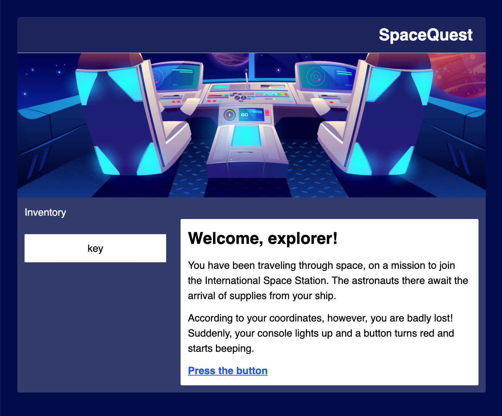

# Workshop Instructions

In this workshop, we will learn how to build a 'Choose Your Own Adventure' game using VuePress, a library that helps you create a text-based web site. VuePress is often used for documentation, but we are going to create a text-based game instead.

| **Project Goal**              | *describe the goal of the project*                                                                                                                                       |
| ----------------------------- | ------------------------------------------------------------------------------------------------------------------------------------------------------------------------ |
| **What will you learn**       | You will create a storytelling choose-your-own adventure type game by enhancing sample code                                                                              |
| **What you'll need**          | Follow the instructions in the **getting started** section below                                                                                                         |
| **Duration**                  | 1 hour instruction and as many hours as you like, working on creating a cool storyline                                                                                   |
| **Just want to try the app?** | A game using this engine at its core is the [Azure Maya Mystery](https://aka.ms/AzureMayaMystery) and the [Azure Space Mystery](https://microsoft.com/AzureSpaceMystery) |

## Getting Started

There are a couple of ways you can work on your game: either locally on your own computer or in a hosted online environment. Today, we're going to use Code Sandbox to get up and running easily. 

👉 [Click here for instructions on how to get setup in Code Sandbox](./sandbox.md)

[Click here for instructions on how to get setup locally](https://github.com/jlooper/static-site-engine)

Once your project is setup either locally or in a hosted environment, you can continue.

## Preparation

So, you want to make a game! Think about what kind of game you'd like to build. Maybe you want to explore a spooky castle? How about a mysterious temple in Peru? Or a Roman ruin in Italy? A Greek temple where, each night, the local people report seeing lights and hearing music?

Think about the graphics that might accompany your game, and a storyline you want to tell. In this game, you wander through a location, picking up items. What kind of items do you want your player to collect? 

Since this is a 'choose-your-own-adventure' type game, you can also have several paths to offer your player. What paths can you send your player down, and are some of those dead ends?  
## Architecture Review

The seed code on which you will build your project has two pages: one that takes you to another page, and another that allows you to collect an item for your inventory. 

Here's how the first screen looks now:



Take some time now to go through the codebase and see how it functions.

### Package.json

In the `game` folder, you find the 'brains' of the web app, the `package.json`. This file tells your app what packages need to be installed to make it run. You can see that this is a VuePress site because that package is listed in the dependencies. You also use 'TailwindCSS', a nice way to style your app by adding classes to your html.

> Note: if you see a circle next to the file name in your editor, that means you haven't yet saved your file. As you work, make sure to keep saving your work so you see it quickly and don't lose it.
### Styles: make your game look good

Note the `tailwind.config.js` folder. The styles of this app are driven by the [Tailwind CSS library](https://tailwindcss.com). You can see how Tailwind markup styles 
elements by looking at `app/game/.vuepress/components/theme/layouts/Layout.vue`. 

Syntax like this: `<div class="markdown-body font-serif bg-white m-2 sm:m-3 md:m-6 lg:m-12 text-lg rounded-lg">` is typical of Tailwind. Adding the class `bg-white` for example creates a white background for the `<div>` in question. 

You can override styles or add new ones in the `app/game/.vuepress/components/theme/styles/` folder. In the `index.styl` file you can tweak a few styles to create a different look for your game.

> It's amazing how a new font can change the entire feel of your game. If you like, create a folder in the `/game/.vuepress/public` folder called `fonts` and install a font. You can download free ones in .ttf format (TrueType Fonts) at [fontsquirrel](https://www.fontsquirrel.com). To make fonts show, edit the font .src:

```src: local('your-font-name'), url(/fonts/your-font-file-name.ttf) format('ttf');
```

While your game is running, edit the `index.styl` file to make the colors look like your game theme. The top area has backdrops, so look for interesting free-to-use images from [Unsplash](https://unsplash.com) or other Creative Commons imagery to use to give an atmosphere to the game. These images go into `public/images` and you can change backdrops in the numbered markdown files like `1.md`.

> Tip: choose images that are wide and short, or crop them, to create good-looking banners.
## Design the game

Now that you have the game running and styled, you can start designing the steps of the game. You can create a linear game by creating a sequence of markdown pages in the `game` folder. You can create a branched experience by adding subfolders like: `game/mission1/1.md`, `game/mission2/1.md` where you give the player decisions on which way to go.
## Build the game

The basic way to build this game is to add markdown pages, written with a storyline, and include markup to switch pages and gather items.

Take a look at `game/README.md`. This is the first page of your game. Notice this code:

```
<Page url="1" instructions="" action="Press the button" condition="none" />
```
This code allows you to create a link to the next page of your game. It includes:

- **the url** (it's pointing to the page `1.md`)
- **instructions** - if you add these, these are bolded comments that appear above the link
- **conditions** - if you add these, they are conditions that must be met for the user to proceed

📌 Task: Create a new page called `3.md` and link to it, using the `<Page>` element.
### Inventory

Take a look at the page you navigate to from the home page: `1.md`. Here you find both a `<Page>` link and an `<Item>`.

In your markdown file, the player sometimes needs to pick up an inventory item. In the code, you allow this by embedding an Item: `<Item id="1" />`. Each item has a number that refers to an item found in `app/game/.vuepress/theme/utils/items.json`. This JSON-formatted file contains all the inventory available to your player:

```
[
	{
		"id": 1,
		"instructions": "Pick up the",
		"name": "key",
		"initialHide": true,
		"result": "You use your ship's robotic arm to pick up the key."
	
		
	},	
	{
		"id": 2,
		"instructions": "instruction 2",
		"name": "name 2",
		"gameItem": "game item 2",
		"initialHide": true
	}
]
```
📌 Task: Practice adding a piece to be picked up by adding a comma to the previous element, and creating a new object:

```
    {
		"id": 3,//match the id
		"instructions": "Pick up the",//written instructions
		"name": "jewel",//clickable word
		"initialHide": true,//don't show this item until a condition is met
		"result": "The jewel suddenly burns red hot!"//what happens when you collect the item
	}
```

### Enhanced Pages

To add a page that depends on a condition being met, use syntax like this: `<Page url="2" instructions="" action="Fly West" condition="1" />` - here, you send your adventurer to page 2 (`2.md`), with optional instructions. The page link will hint where you're going, and the page link won't show until a condition is met (in this case, you have to pick up the key with item.id 1 to see the link). Experiment with the engine to customize your user's journey. 

> Advanced: If you want to make changes to the logic of the relationship between inventory and page, edit the `app/game/.vuepress/game/Page.vue` file. You can see how certain elements appear and disappear based on the way the page links are formatted.

Now, you know how to create a basic page, an element to add to the inventory, and a more complicated page whose link will show IF an element is added to inventory. You have the building blocks of a game!

## Deploy the app

If you'd like to deploy this game to the cloud using Azure Static Web Apps, here's a button to help you do that: 

[](https://portal.azure.com/?feature.customportal=false&WT.mc_id=academic-9433-jelooper#create/Microsoft.StaticApp)

## Next steps

You can always make a game more complex! How can you add more interest, or a more winding storyline, to your game?
## Feedback

If you have feedback on this workshop, open a GitHub issue on this repo to let us know.

[Code of Conduct](CODE_OF_CONDUCT.md)

[Contributing Guide](CONTRIBUTING.md)
