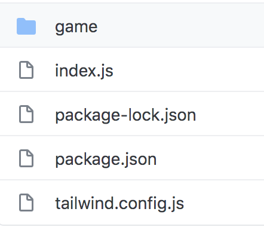
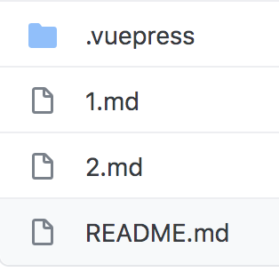

# Workshop Instructions

In this workshop, we will learn how to build a 'Choose Your Own Adventure' game using VuePress, a library that helps you create a text-based web site. VuePress is often used for documentation, but we are going to create a text-based game instead.

| **Project Goal**              | *describe the goal of the project*                                                                                                                                       |
| ----------------------------- | ------------------------------------------------------------------------------------------------------------------------------------------------------------------------ |
| **What will you learn**       | You will create a storytelling choose-your-own adventure type game by enhancing sample code                                                                              |
| **What you'll need**          | Follow the instructions in the **getting started** section below                                                                                                         |
| **Duration**                  | 1 hour instruction and as many hours as you like, working on creating a cool storyline                                                                                   |
| **Just want to try the app?** | A game using this engine at its core is the [Azure Maya Mystery](https://aka.ms/AzureMayaMystery) and the [Azure Space Mystery](https://microsoft.com/AzureSpaceMystery) |

## Getting Started

There are a couple of ways you can work on your game either:

- **locally** on your own computer.

   👉 [Click here for instructions on how to get setup locally](https://github.com/jlooper/static-site-engine)

- **in a hosted online environment**.

   👉 [Click here for instructions on how to get setup in Code Sandbox](./sandbox.md)

📌 Task: Choose on of the two above links.

Once your project is setup either locally or in a hosted environment, you can continue.

## Preparation

So, you want to make a game! Think about what kind of game you'd like to build. Here are some ideas:

- **Spooky castle**. Maybe you want to explore a spooky castle?
- **Mysterious temple**. How about a mysterious temple in Peru?
- **Roman ruin**. Or a Roman ruin in Italy?
- **Greek temple**. A Greek temple where, each night, the local people report seeing lights and hearing music?
- **Your own idea**. You decide what you want to create.

📌 Task: Select one of the ideas above.

> TIP: Think about the graphics that might accompany your game, and a storyline you want to tell. In this game, you wander through a location, picking up items. What kind of items do you want your player to collect?

Since this is a 'choose-your-own-adventure' type game, you can also have several paths to offer your player. What paths can you send your player down, and are some of those dead ends?

## What you have

Here's an overview of the files in your project:



You will work with the directory _game_. If you look inside the _game_ directory, you will see the following:



You have something called _seed code_, a set of files that are already there, that you can modify if you want.

There are files ending in _.md_ that represents room in the game. There are two of them, _1.md_ and _2.md_. They are different, lets explain how:

- **First page, 1.md**. This page has a link on it. By clicking the link you will be taken to a new room in the game.
- **Second page, 2.md**. The second page has link representing an item. If you click the item, the item will be added to your inventory. The inventory is on your left side.

If you click the , it will run the game.

Look in your bottom right section of the screen at _REPL.it-link_ 

What you see is a rendered version of the file _1.md_:


> TIP, Spend a few minutes going through the codebase and see how it functions.

### The brain of your app, `package.json`

In the `game` folder, you find the _brains_ of the web app, the _package.json_. This file tells your app what packages need to be installed to make it run. 

You can see that this is a VuePress site because that package is listed in the dependencies. You also use 'TailwindCSS', a nice way to style your app by adding classes to your html.

> Note: if you see a circle next to the file name in your editor, that means you haven't yet saved your file. As you work, make sure to keep saving your work so you see it quickly and don't lose it.

### Styles: make your game look good

Note the _tailwind.config.js_ file. The styles of this app are driven by the [Tailwind CSS library](https://tailwindcss.com).

You can see how Tailwind markup styles
elements by looking at _app/game/.vuepress/components/theme/layouts/Layout.vue_. 

Syntax like this:

```html
<div class="markdown-body font-serif bg-white m-2 sm:m-3 md:m-6 lg:m-12 text-lg rounded-lg">
``` 

is typical of Tailwind. Adding the class `bg-white` for example creates a white background for the `<div>` in question.

**Overriding**

You can override styles or add new ones in the `app/game/.vuepress/components/theme/styles/` folder. In the `index.styl` file you can tweak a few styles to create a different look for your game.

> It's amazing how a new font can change the entire feel of your game.

📌 (Optional)Task: Install and use a new font
 
1. **Create a folder** in the _/game/.vuepress/public_ directory called **fonts** to install a font. 
1. **Download a font**. You can download free ones in .ttf format (TrueType Fonts) at [fontsquirrel](https://www.fontsquirrel.com).

1. **Use font**. To make fonts show, edit the font .src:

   ```css
   src: local('your-font-name'), url(/fonts/your-font-file-name.ttf) format('ttf');
   ```

📌 (Optional)Task: Change colors of your game

1. While your game is running, locate the file _index.styl_

1. Change the value of variable and change it to Y, this will change the header color.

   ```css
	 $variable = purple
	 ```

📌 (Optional)Task: Work on a theme

As part of giving your game a nice look, you can change some of the images.

1. **Download image**. Look for interesting free-to-use images from [Unsplash](https://unsplash.com) or other Creative Commons imagery to use to give an atmosphere to the game.

1. **Store image**. In your project, go to sub directory _public/images_. Once you find a file you like, name it _room-1-background.jpg_

1. **Use image**. To ensure the background is changed for a specific room, go to the top of the file _1.md_ and locate this part:

   ```markdown
	 ---
   backdrop: images/controls.png
   ---
	 ```

   Change it to this text:

   ```markdown
	 ---
   backdrop: images/room-1-background.png
   ---
	 ```

> Tip: choose images that are wide and short, or crop them, to create good-looking banners.

## Design the game

Now that you have the game running and styled, you can start designing the steps of the game.

You can create a _linear_ game by creating a sequence of markdown pages in the `game` folder. You can create a _branched_ experience by adding subfolders like: `game/mission1/1.md`, `game/mission2/1.md` where you give the player decisions on which way to go. The idea is when a player arrives in a room they can choose whether to solve mission 1 or mission 2 first. They can always go back at a later point and solve the mission they didn't pick in the first round.

## Build the game

The basic way to build this game is to follow these steps in order:

1. **Add markdown pages**, for every markdown page you add, this is a room that the player of the game might be able to visit if you provide a door to it (a link can be thought of as a door).
1. **Write a storyline**, At this point, you want to add a description of your room, what it looks like, what they player experience. An example description could be a text like this:

   ```markdown
	 You're inside the room of the old castle. There's a suite of armour to your left and a stand on yoour right side with three swords placed on it. There's a table in front of you. On the table, there's [written note](note.md)
	 ```

1. **Add door and items**. The last thing you want to do, designing a room, is to include markup instructions to provide links, that will server as doors, and other types of links that will represent items that you can pick up.

You don't need to doo any of the above, just keep these instructions in mind so you understand how to add content to your game.

📌 Task: Understand how a room is defined. You don't need to do anything in this task. Just read the text, take notes if you feel you need to.

1. Take a look at the file _game/README.md_. This is the first page of your game. Notice this code:

   ```html
   <Page url="1" instructions="" action="Press the button" condition="none" />
   ```

   This code defines a door that leads from your current room to another room. When this link is clicked, the player moves to the new room. 

   - Look at the part that says **url="1"**, the game engine will translate this too mean _1.md_, that's where the player ends up if they click the link. 
   - Now look at **action="Press the button"**, the value **Press the button** is what the player will see as an underlined text.
   - Finally, look at **condition="none"**, this instruction says if there are any items you need to have picked up before this link can be clicked. If it has a value like so **condition="1"**, that means you need to have an item in your inventory with ID 1. If you don't have the item, then clicking the link won't take you to the new room.

It includes:

- **the url** (it's pointing to the page `1.md`)
- **instructions** - if you add these, these are bolded comments that appear above the link
- **conditions** - if you add these, they are conditions that must be met for the user to proceed

📌 Task: Create a new room, the engine room

1. Create a new page called _3.md_. Give the file the following content:

   ```markdown
   # Engine room
 
	 This is the engine room of the spaceship. There's a huge reactor in the middle of the room. There are engineers positioned in various parts of the room looking at different instruments to make sure the engine works as it should.
	 ```

1. Open the file _1.md_ and add the following content at the bottom of the file:

   ```markdown
	 <Page url="3" instructions="" action="Go to room" condition="none" />
	 ```

1. Run the game by pressing the play button. You should now see a link that says **Go to room** at the bottom of the page.

1. Click the link **Go to room**:

   You should now be taken to the Engine room. You should see the following text that you typed earlier:

   ```output
   Engine room
 
	 This is the engine room of the spaceship. There's a huge reactor in the middle of the room. There are engineers positioned in various parts of the room looking at different instruments to make sure the engine works as it should.
   ```

   Congratulations, you've just done the following things:

   - Added a new room, _3.md_ plus a description of the room
   - Added a navigation link to another room
   - Ensured your game worked by saving all the changes and tried clicking a link you added


### Inventory

You can think of the inventory as a rug sack or a bag where you can store things that you carry with you throughout the game. Items are stored in the inventory and these items are sometimes keys to doors and sometimes the purpose is just to collect a set of items to solve a mission.

Remember the file called _1.md_, you added a navigation instruction at the bottom of it to link it to _3.md_. However, there was already some text in it and som links at the bottom looking like this:

```markdown
<Item id="1" />

<Item id="2" />

<Page url="2" instructions="" action="Fly West" condition="1" />
<Page url="3" instructions="" action="Go to room" condition="none" />
```

The first two links are items, you can see that as the element is called `<Item>`. When clicked these item will end up in your inventory.

The two bottom elements are doors to actions the player can take next:

```markdown
<Page url="2" instructions="" action="Fly West" condition="1" />
<Page url="3" instructions="" action="Go to room" condition="none" />
```

**How to create an item**

To create an item you need to do two things:

- **Add a description of the item**. To do this locate the file called _app/game/.vuepress/theme/utils/items.json_, this is where all items are defined that's used in the game. If you open up this file, you will see content similar to this text:

   ```json
   [
    	{
    		"id": 1,
    		"instructions": "Pick up the",
    		"name": "key",
    		"initialHide": true,
    		"result": "You use your ship's robotic arm to pick up the key."
    	
    		
    	},	
    	...
  ]
  ```

  What you are seeing above is how an item is defined. It has a few fields that needs to be filled in:

     - **id**, this field needs to be a number and it needs to be unique, no other items in this file may have the same number
     - **instructions**, this text is rendered so the player of the game sees it
     - **result**, this text is shown once the player clicks the item link and the item is added to your inventory.

- **placing the item in a room**. Looking at the file _room1.md_, by scrolling to the bottom of the file and locating these elements:

   ```markdown
	 <Item id="1" />

   <Item id="2" />
	 ```

   you can see that this room has two items **1** and **2** that the player can pick up, if they want.

📌 Task: Add a new item to the game:

1. Locate the file _app/game/.vuepress/theme/utils/items.json_. Ensure the content of the file looks like so:

   ```json
	 [
    	{
    		"id": 1,
    		"instructions": "Pick up the",
    		"name": "key",
    		"initialHide": true,
    		"result": "You use your ship's robotic arm to pick up the key."
    	},
    	{
    		"id": 2,
    		"instructions": "Ignore the, key and instead pick up an interesting",
    		"name": "meteorite",
    		"initialHide": true,
    		"result": "That's not super helpful. Now what?"
    	}, 
      {
    		"id": 3,//match the id
    		"instructions": "Pick up the",//written instructions
    		"name": "jewel",//clickable word
    		"initialHide": true,//initially hide results
    		"result": "The jewel suddenly burns red hot!"//what happens when you collect the item
    	}
    ]
	 ```

   What you've done is to add this piece of JSON to the file:

   ```json
	 {
    		"id": 3,//match the id
    		"instructions": "Pick up the",//written instructions
    		"name": "jewel",//clickable word
    		"initialHide": true,//initially hide results
    		"result": "The jewel suddenly burns red hot!"//what happens when you collect the item
	 }
	 ```

   The game now is aware of that this item exist. Next let's place the item in a room so the player can pick up this item.

1. Locate the file _3.md_. To the bottom of the file, add the content:

   ```markdown
	 <Item id="3" />
	 ```

1. Run the game.

1. Click the link **Go to room**.

   Now you ended up in the room described by the file _3.md_. You should see a link that says **pick up the jewel**

1. Click the link **pick up the jewel**, note how the jewel is added to the inventory on your left side.

### Enhanced Pages

To make the user's experience more interesting, you can add a link that only becomes available when a user meets a given condition. Let's do this next.

📌 Task: Add a locked door, that can be unlocked by an item:

1. In the file _1.md_ locate the instruction that looks like so:

   ```markdown
	 <Page url="2" instructions="" action="Fly West" />
	 ```

   change it to look like so:

   ```markdown
	 <Page url="2" instructions="" action="Fly West" condition="1" />
	 ```

   What you've done is to add this part **condition="1"** that means you need to find and pick up an item with ID 1. If you were to run the game the link **Fly West** is no longer visible. You've instructed the game to hide this link until the player picks up the correct item.

   Lucky for the player, that item is available in the first room they are standing in.

  > Tip, if you want to make the game challenging, you want to hide an item in room somewhere in your world so they player needs to explore a bit. Once they pick up the item, they can then return to that first room.

1. Pick up the item by clicking **Pick up the key**. When you click this link, the link **Fly West** will become visible.


> Advanced: If you want to make changes to the logic of the relationship between inventory and page, edit the `app/game/.vuepress/game/Page.vue` file. You can see how certain elements appear and disappear based on the way the page links are formatted.

Now, you know how to create a basic page, an element to add to the inventory, and a more complicated page whose link will show IF an element is added to inventory. You have the building blocks of a game!

## Deploy the app

If you'd like to deploy this game to the cloud using Azure Static Web Apps, here's a button to help you do that: 

[](https://portal.azure.com/?feature.customportal=false&WT.mc_id=academic-9433-jelooper#create/Microsoft.StaticApp)

## Next steps

You can always make a game more complex! How can you add more interest, or a more winding storyline, to your game?
## Feedback

If you have feedback on this workshop, open a GitHub issue on this repo to let us know.

[Code of Conduct](CODE_OF_CONDUCT.md)

[Contributing Guide](CONTRIBUTING.md)
